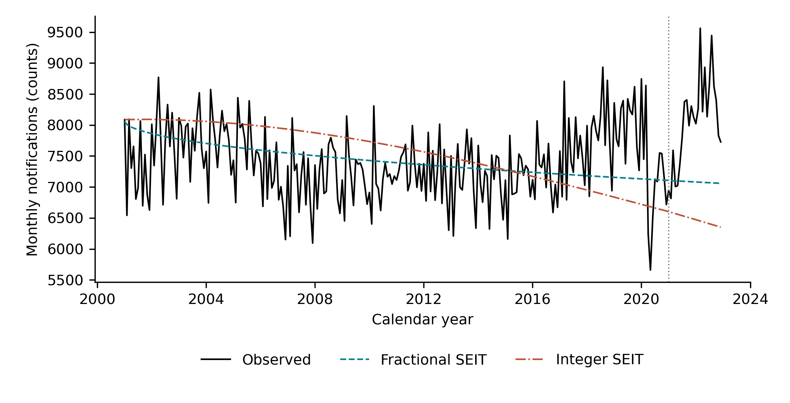
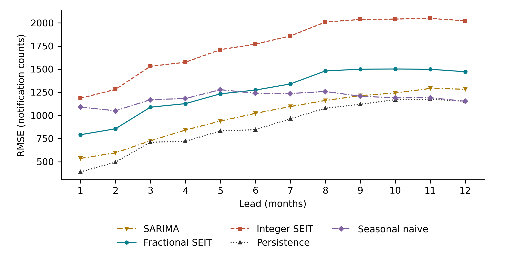
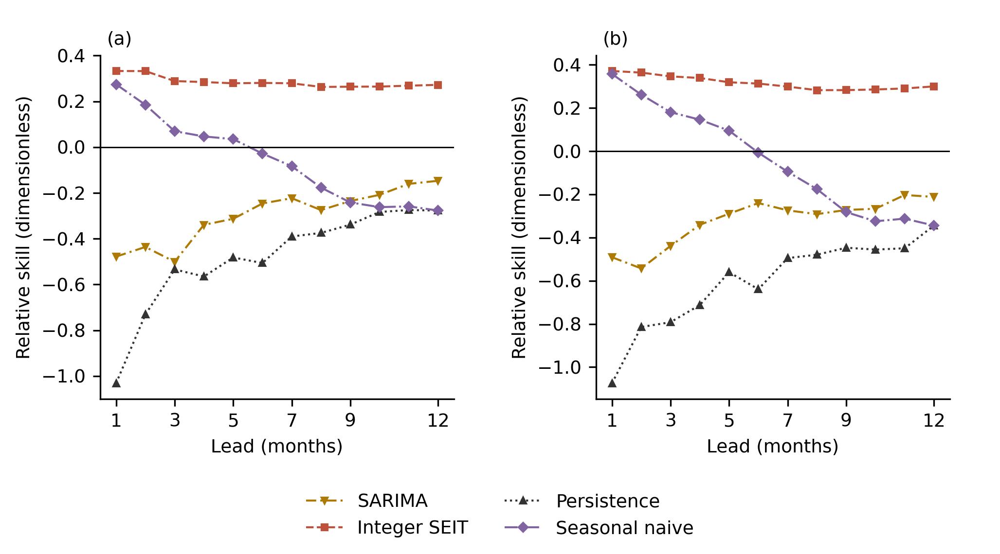
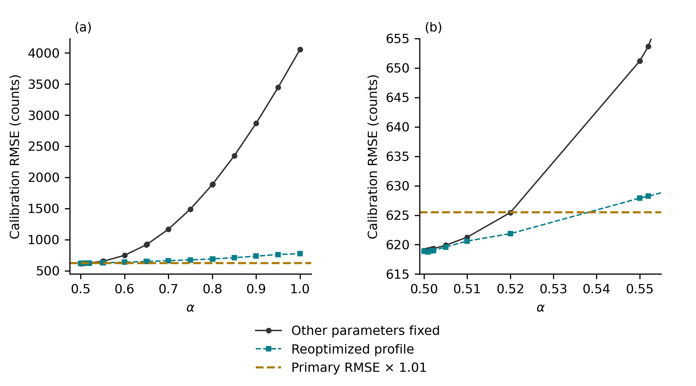
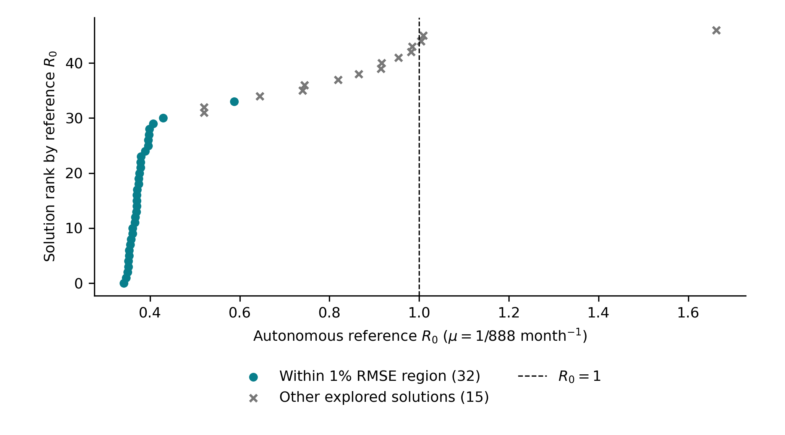

# Editorial figures — corrected S1 evidence, 10 October 2026

Five English presentation figures copied byte-for-byte from `TB_SEIT_INTEGRATED_REVIEW_2026-10-10_V2`. PDF and SVG are vector assets; PNG is rendered at 300 dpi. The figures were prepared at 174 mm width with 9-point lettering, embedded PDF fonts, and distinct line patterns or markers.

The bundle preserves all plotted values, axis limits, thresholds, and solution memberships from the frozen representations. `FIGURE_EQUIVALENCE.json` and `SOURCE_AND_FILE_HASHES.json` document the checks and source hashes. Frozen originals and the supplied observational file remain unchanged.

Use the named PDF files for the five figure callouts in the Springer LaTeX working draft. Keep captions in the manuscript. Final typesetting and scientific approval remain with the authors.

| Figure | PDF | PNG | SVG |
| --- | --- | --- | --- |
| 1 | [F1_global_open_loop.pdf](F1_global_open_loop.pdf) | [PNG](F1_global_open_loop.png) | [SVG](F1_global_open_loop.svg) |
| 2 | [F2_rolling_RMSE.pdf](F2_rolling_RMSE.pdf) | [PNG](F2_rolling_RMSE.png) | [SVG](F2_rolling_RMSE.svg) |
| 3 | [F3_fractional_skill.pdf](F3_fractional_skill.pdf) | [PNG](F3_fractional_skill.png) | [SVG](F3_fractional_skill.svg) |
| 4 | [F4_alpha_profiles.pdf](F4_alpha_profiles.pdf) | [PNG](F4_alpha_profiles.png) | [SVG](F4_alpha_profiles.svg) |
| 5 | [F5_R0_explored_pool.pdf](F5_R0_explored_pool.pdf) | [PNG](F5_R0_explored_pool.png) | [SVG](F5_R0_explored_pool.svg) |

## Captions and previews

**Fig. 1** Observed monthly counts and the independently fitted fractional and integer S1 trajectories. The vertical line separates global calibration through 2020 from the fixed-origin open-loop validation. This comparison does not establish external-baseline skill

**Fig. 2** RMSE at each of the 12 monthly leads for fractional SEIT, integer SEIT, persistence, seasonal naive, and SARIMA, on the same 13-origin support

**Fig. 3** Fractional relative skill for (a) RMSE and (b) MAE, separating integer SEIT from the three external benchmarks. The zero line denotes equal error. Positive skill against integer throughout and against seasonal naive only through $h=5$ coexists with negative skill against persistence and SARIMA throughout

**Fig. 4** Fixed-section and reoptimized calibration RMSE at (a) all 21 $\alpha$ values and (b) a close view of the lower boundary. The dashed line is the preserved primary RMSE multiplied by 1.01. Connecting lines guide the eye between evaluated points and do not define a continuous confidence region

**Fig. 5** All 47 reference R₀ values, with the 32 solutions admitted by the primary-relative 1% RMSE criterion distinguished from the remaining diagnostics. The line at one is a reference threshold, not a forecast of disease elimination

## Scientific scope

The within-family fractional advantage is descriptive and does not establish competitive skill against persistence or SARIMA. The seasonal-naive advantage ends at lead 5. The identifiability and autonomous-reference analyses remain secondary diagnostics, with the previously documented limits. This upload supplies figure assets for author review; it does not integrate the revised manuscript or establish submission readiness.
