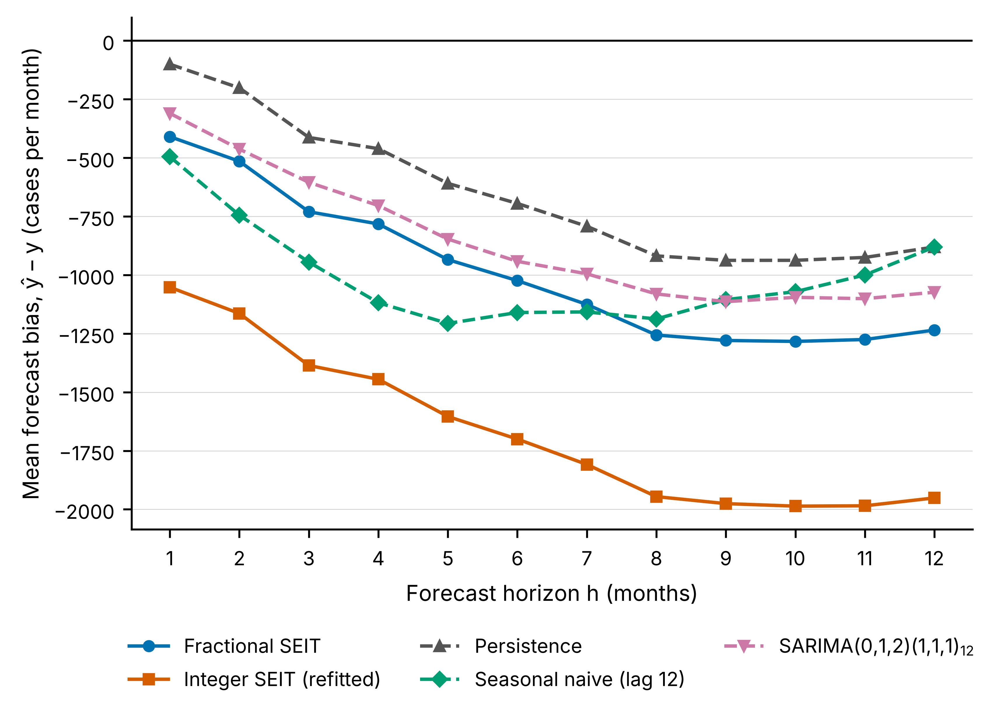

# Supplementary Information

**Within-Family Improvement Versus External Forecast Skill in a Fractional SEIT Tuberculosis Model**

These descriptive supporting tables reproduce frozen results from `results_canonical/` and the archived fit-level files in `outputs/calibration/` and `outputs/identifiability/`. No forecasting models or epidemic-system simulations were re-run to prepare these tables. Numerical entries are displayed at rounded precision. The single-origin stress test and the rolling-origin assessment are distinct evaluations.

## Figure S1: Mean forecast bias

**Figure S1.** Mean directional forecast bias (forecast minus observation) by monthly forecast lead horizon across 13 rolling origins. Negative values represent average underprediction. This diagnostic figure does not establish a causal mechanism or comparative forecasting superiority.

---

**Table S1A. Single-origin 24-month long open-loop stress test (calibration through 2020-12; continuous open-loop simulation for 2021-01 to 2022-12).**

| Model | RMSE | MAE | Bias |
|---|---:|---:|---:|
| Fractional | 1118.0 | 953.2 | -851.1 |
| Integer | 1759.5 | 1588.6 | -1588.6 |

This is a stress test from one origin, not a forecasting-skill evaluation. Its values must not be compared with, or merged into, the 13-origin rolling-origin metrics in Table S1B. Bias is forecast minus observation (negative: under-prediction).

---

**Table S1B. Rolling-origin evaluation (13 expanding-window origins, 2020-12 to 2021-12): horizon-specific RMSE, MAE and mean bias for each model and baseline ($n = 13$ forecasts per cell).**

*RMSE*

| $h$ | Fractional | Integer | Persistence | Seasonal naive | SARIMA |
|---|---:|---:|---:|---:|---:|
| 1 | 688.9 | 1185.8 | 389.7 | 1090.6 | 535.5 |
| 2 | 747.0 | 1281.1 | 494.3 | 1049.8 | 595.8 |
| 3 | 975.0 | 1530.9 | 710.0 | 1170.5 | 725.8 |
| 4 | 1008.4 | 1575.0 | 720.3 | 1182.6 | 841.7 |
| 5 | 1109.7 | 1711.0 | 832.5 | 1278.4 | 939.7 |
| 6 | 1138.3 | 1770.7 | 845.9 | 1239.2 | 1022.4 |
| 7 | 1203.5 | 1858.6 | 964.2 | 1237.4 | 1096.0 |
| 8 | 1351.2 | 2009.2 | 1077.2 | 1258.4 | 1161.6 |
| 9 | 1369.8 | 2037.3 | 1120.4 | 1207.9 | 1214.0 |
| 10 | 1378.6 | 2041.7 | 1170.3 | 1189.9 | 1242.8 |
| 11 | 1372.9 | 2048.8 | 1175.9 | 1190.8 | 1291.8 |
| 12 | 1356.0 | 2022.5 | 1153.0 | 1153.0 | 1283.6 |

*MAE*

| $h$ | Fractional | Integer | Persistence | Seasonal naive | SARIMA |
|---|---:|---:|---:|---:|---:|
| 1 | 602.6 | 1052.2 | 318.9 | 1029.8 | 443.8 |
| 2 | 659.1 | 1164.0 | 408.2 | 1002.9 | 479.9 |
| 3 | 809.6 | 1386.2 | 505.7 | 1105.8 | 629.8 |
| 4 | 856.3 | 1444.8 | 557.8 | 1118.4 | 712.3 |
| 5 | 968.8 | 1603.8 | 699.9 | 1206.6 | 846.7 |
| 6 | 1024.0 | 1700.2 | 712.5 | 1160.0 | 941.8 |
| 7 | 1125.7 | 1808.5 | 847.8 | 1157.5 | 995.0 |
| 8 | 1256.1 | 1945.7 | 943.5 | 1187.5 | 1080.8 |
| 9 | 1279.3 | 1975.5 | 979.2 | 1105.1 | 1113.7 |
| 10 | 1283.3 | 1986.2 | 974.7 | 1071.2 | 1120.1 |
| 11 | 1275.2 | 1984.8 | 971.6 | 1073.2 | 1170.9 |
| 12 | 1235.0 | 1951.2 | 1016.2 | 1016.2 | 1127.2 |

*Mean bias (forecast minus observation)*

| $h$ | Fractional | Integer | Persistence | Seasonal naive | SARIMA |
|---|---:|---:|---:|---:|---:|
| 1 | -409.6 | -1052.2 | -100.5 | -495.1 | -310.1 |
| 2 | -514.7 | -1164.0 | -201.5 | -744.6 | -462.8 |
| 3 | -730.1 | -1386.2 | -412.9 | -944.9 | -604.6 |
| 4 | -782.1 | -1444.8 | -460.8 | -1118.4 | -703.7 |
| 5 | -934.3 | -1603.8 | -609.0 | -1206.6 | -846.7 |
| 6 | -1024.0 | -1700.2 | -694.6 | -1160.0 | -941.8 |
| 7 | -1125.7 | -1808.5 | -792.2 | -1157.5 | -995.0 |
| 8 | -1256.1 | -1945.7 | -918.5 | -1187.5 | -1080.8 |
| 9 | -1279.3 | -1975.5 | -937.5 | -1105.1 | -1113.7 |
| 10 | -1283.3 | -1986.2 | -937.3 | -1071.2 | -1095.2 |
| 11 | -1275.2 | -1984.8 | -925.0 | -999.8 | -1101.0 |
| 12 | -1235.0 | -1951.2 | -880.5 | -880.5 | -1073.4 |

Values are notifications per month. Persistence and seasonal naive coincide at $h = 12$ by construction. These values underlie Figure 1 and Figure S1. They are descriptive sample metrics.

---

**Table S2. Observed relative forecasting skill by horizon, $1 - \mathrm{Error}_M(h)/\mathrm{Error}_B(h)$, for the fractional and integer SEIT models against each external baseline (13 origins).**

*Fractional SEIT relative to each external baseline*

| $h$ | Persistence (RMSE) | Persistence (MAE) | Seasonal naive (RMSE) | Seasonal naive (MAE) | SARIMA (RMSE) | SARIMA (MAE) |
|---|---:|---:|---:|---:|---:|---:|
| 1 | -0.768 | -0.889 | 0.368 | 0.415 | -0.286 | -0.358 |
| 2 | -0.511 | -0.615 | 0.288 | 0.343 | -0.254 | -0.373 |
| 3 | -0.373 | -0.601 | 0.167 | 0.268 | -0.343 | -0.286 |
| 4 | -0.400 | -0.535 | 0.147 | 0.234 | -0.198 | -0.202 |
| 5 | -0.333 | -0.384 | 0.132 | 0.197 | -0.181 | -0.144 |
| 6 | -0.346 | -0.437 | 0.081 | 0.117 | -0.113 | -0.087 |
| 7 | -0.248 | -0.328 | 0.027 | 0.027 | -0.098 | -0.131 |
| 8 | -0.254 | -0.331 | -0.074 | -0.058 | -0.163 | -0.162 |
| 9 | -0.223 | -0.307 | -0.134 | -0.158 | -0.128 | -0.149 |
| 10 | -0.178 | -0.317 | -0.159 | -0.198 | -0.109 | -0.146 |
| 11 | -0.167 | -0.312 | -0.153 | -0.188 | -0.063 | -0.089 |
| 12 | -0.176 | -0.215 | -0.176 | -0.215 | -0.056 | -0.096 |

*Integer SEIT relative to each external baseline*

| $h$ | Persistence (RMSE) | Persistence (MAE) | Seasonal naive (RMSE) | Seasonal naive (MAE) | SARIMA (RMSE) | SARIMA (MAE) |
|---|---:|---:|---:|---:|---:|---:|
| 1 | -2.043 | -2.299 | -0.087 | -0.022 | -1.214 | -1.371 |
| 2 | -1.592 | -1.852 | -0.220 | -0.161 | -1.150 | -1.426 |
| 3 | -1.156 | -1.741 | -0.308 | -0.253 | -1.109 | -1.201 |
| 4 | -1.187 | -1.590 | -0.332 | -0.292 | -0.871 | -1.028 |
| 5 | -1.055 | -1.291 | -0.338 | -0.329 | -0.821 | -0.894 |
| 6 | -1.093 | -1.386 | -0.429 | -0.466 | -0.732 | -0.805 |
| 7 | -0.928 | -1.133 | -0.502 | -0.562 | -0.696 | -0.818 |
| 8 | -0.865 | -1.062 | -0.597 | -0.638 | -0.730 | -0.800 |
| 9 | -0.818 | -1.018 | -0.687 | -0.788 | -0.678 | -0.774 |
| 10 | -0.745 | -1.038 | -0.716 | -0.854 | -0.643 | -0.773 |
| 11 | -0.742 | -1.043 | -0.721 | -0.849 | -0.586 | -0.695 |
| 12 | -0.754 | -0.920 | -0.754 | -0.920 | -0.576 | -0.731 |

Positive values indicate lower observed error for the SEIT model than for the baseline. These are descriptive sample comparisons; they were not subjected to a prespecified predictive-accuracy significance test. At $h = 12$ the persistence and seasonal-naive columns coincide by construction.

---

**Table S3. Profile-objective diagnostic exploration: parameter values, calibration RMSE and $R_0$ for the 33 solutions pooled from the five multiseed fits and the 28 one-dimensional profile-objective fits.**

| Solution | $\beta$ | $\sigma$ | $\gamma$ | $d$ | $\alpha$ | Cal. RMSE | $\Delta$RMSE (%) | $R_0$ | Admissible |
|---|---:|---:|---:|---:|---:|---:|---:|---:|---:|
| Multiseed, seed 20260815 | 0.0762 | 0.01002 | 0.0568 | 0.00031 | 0.9640 | 605.049 | +0.00 | 1.1756 | yes |
| Multiseed, seed 20260816 | 0.4130 | 0.01012 | 0.2818 | 0.03652 | 0.9635 | 610.388 | +0.88 | 1.1633 | yes |
| Multiseed, seed 20260817 | 0.0852 | 0.01015 | 0.0541 | 0.00935 | 0.9620 | 606.273 | +0.20 | 1.1867 | yes |
| Multiseed, seed 20260818 | 0.2781 | 0.01014 | 0.1739 | 0.03858 | 0.9622 | 609.571 | +0.75 | 1.1718 | yes |
| Multiseed, seed 20260819 | 0.3856 | 0.01004 | 0.2848 | 0.00999 | 0.9624 | 609.874 | +0.80 | 1.1716 | yes |
| Profile, β fixed at 0.036465 | 0.0365 | 0.01001 | 0.0500 | 0.00014 | 1.0000 | 2680.440 | +343.01 | 0.6393 | no |
| Profile, β fixed at 0.056314 | 0.0563 | 0.01022 | 0.0500 | 0.00010 | 0.9999 | 797.154 | +31.75 | 0.9902 | no |
| Profile, β fixed at 0.069547 | 0.0695 | 0.01001 | 0.0515 | 0.00025 | 0.9636 | 604.748 | -0.05 | 1.1816 | yes |
| Profile, β fixed at 0.076164 | 0.0762 | 0.01014 | 0.0529 | 0.00388 | 0.9625 | 605.245 | +0.03 | 1.1836 | yes |
| Profile, β fixed at 0.16855 | 0.1685 | 0.01003 | 0.0920 | 0.03600 | 0.9626 | 608.097 | +0.50 | 1.1735 | yes |
| Profile, β fixed at 0.35331 | 0.3533 | 0.01018 | 0.2428 | 0.02883 | 0.9627 | 610.329 | +0.87 | 1.1662 | yes |
| Profile, β fixed at 0.63047 | 0.6305 | 0.01003 | 0.3000 | 0.04990 | 0.8898 | 1033.757 | +70.86 | 1.6149 | no |
| Profile, γ fixed at 0.052722 | 0.0749 | 0.01017 | 0.0527 | 0.00322 | 0.9628 | 605.156 | +0.02 | 1.1811 | yes |
| Profile, γ fixed at 0.054764 | 0.0903 | 0.01001 | 0.0548 | 0.01271 | 0.9625 | 605.959 | +0.15 | 1.1836 | yes |
| Profile, γ fixed at 0.056125 | 0.0757 | 0.01001 | 0.0561 | 0.00060 | 0.9642 | 605.089 | +0.01 | 1.1761 | yes |
| Profile, γ fixed at 0.056806 | 0.1193 | 0.01007 | 0.0568 | 0.03338 | 0.9630 | 606.998 | +0.32 | 1.1748 | yes |
| Profile, γ fixed at 0.081125 | 0.1208 | 0.01004 | 0.0811 | 0.01019 | 0.9633 | 607.112 | +0.34 | 1.1752 | yes |
| Profile, γ fixed at 0.12976 | 0.1789 | 0.01002 | 0.1298 | 0.00670 | 0.9635 | 608.295 | +0.54 | 1.1691 | yes |
| Profile, γ fixed at 0.20272 | 0.2688 | 0.01014 | 0.2027 | 0.00366 | 0.9637 | 609.702 | +0.77 | 1.1660 | yes |
| Profile, d fixed at 0.00018381 | 0.3517 | 0.01011 | 0.2675 | 0.00018 | 0.9608 | 610.239 | +0.86 | 1.1770 | yes |
| Profile, d fixed at 0.00024666 | 0.3535 | 0.01002 | 0.2707 | 0.00025 | 0.9630 | 609.696 | +0.77 | 1.1680 | yes |
| Profile, d fixed at 0.00028857 | 0.1323 | 0.01012 | 0.1000 | 0.00029 | 0.9631 | 607.651 | +0.43 | 1.1746 | yes |
| Profile, d fixed at 0.00030952 | 0.0768 | 0.01013 | 0.0566 | 0.00031 | 0.9615 | 605.548 | +0.08 | 1.1892 | yes |
| Profile, d fixed at 0.0052786 | 0.2957 | 0.01018 | 0.2215 | 0.00528 | 0.9630 | 609.833 | +0.79 | 1.1682 | yes |
| Profile, d fixed at 0.015217 | 0.4030 | 0.01020 | 0.2949 | 0.01522 | 0.9629 | 610.408 | +0.89 | 1.1662 | yes |
| Profile, d fixed at 0.030124 | 0.1186 | 0.01002 | 0.0600 | 0.03012 | 0.9641 | 607.173 | +0.35 | 1.1684 | yes |
| Profile, α fixed at 0.6856 | 0.4414 | 0.49940 | 0.2943 | 0.04871 | 0.6856 | 1372.490 | +126.84 | 1.2799 | no |
| Profile, α fixed at 0.82481 | 0.0681 | 0.49850 | 0.0501 | 0.00020 | 0.8248 | 812.474 | +34.28 | 1.3206 | no |
| Profile, α fixed at 0.91761 | 0.0655 | 0.05761 | 0.0516 | 0.00048 | 0.9176 | 674.660 | +11.51 | 1.2077 | no |
| Profile, α fixed at 0.96401 | 0.1769 | 0.01004 | 0.1100 | 0.02501 | 0.9640 | 608.590 | +0.59 | 1.1686 | yes |
| Profile, α fixed at 0.96761 | 0.0881 | 0.01015 | 0.0539 | 0.01375 | 0.9676 | 608.684 | +0.60 | 1.1542 | yes |
| Profile, α fixed at 0.97481 | 0.0651 | 0.01000 | 0.0506 | 0.00037 | 0.9748 | 621.609 | +2.74 | 1.1228 | no |
| Profile, α fixed at 0.9856 | 0.1017 | 0.01005 | 0.0543 | 0.02977 | 0.9856 | 674.030 | +11.40 | 1.0736 | no |

Each profile fit fixes one parameter at a grid value (seven points per parameter, never touching a bound) and re-optimizes the other four with the canonical seed (20260815) on the calibration window only. This is a profile-objective diagnostic exploration, not a formal profile-likelihood confidence analysis. $\Delta$RMSE is relative to the primary optimum (605.049). The 25 solutions with $\Delta$RMSE $\le 1.0\%$ form the admissible set used for the primary $R_0$ and DFE statements; the remaining eight include deliberately poor-fit probes and do not support those statements. Two solutions in the pool have $R_0 < 1$ (β fixed at 0.0365 and 0.0563), so $R_0 > 1$ must not be stated for the whole pool. The profile grids reach at most 60% of the distance from the canonical value to each bound.

**Table S3 evidence boundary.** The frozen summary supports 25/25 locally unstable DFE classifications among admissible solutions, as reported in main-text Table 2, but it does not retain a per-solution DFE label for the full 33-member diagnostic pool. No per-row DFE classifications are inferred. The admissibility flag is based on calibration RMSE within 1% of the primary-seed RMSE, not a statistical confidence region.
